# 🏳️‍⚧️ 欢迎，这里是小锂
*(名字来源于一种药物——碳酸锂)*  

🌐 点击这里切换语言喔~ |Click here to change language | [简体中文](README.md) | [English](README_EN.md)  

---

## 💻 我的设备

⌨️ **键盘**：RK R65  
🖱️ **鼠标**：MCHOSE A7 Pro  
🎧 **耳机**：ROG 降临 2  
💻 **笔记本**：ASUS 天选 3 Puls  

---

## 🛠️ 我的技能
~~学过的东西都好杂，各个领域都有涉及啦（~~  

### 🎬 影视后期  
~~其实就是 Adobe 全家桶~~  

  
  
  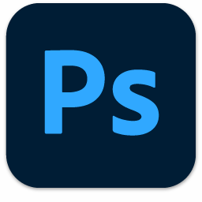
  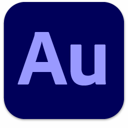
  
  
  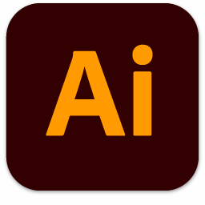

---

### 💻 编程语言
~~学是学了，但是记不记得住就不一定了（~~ 

  
  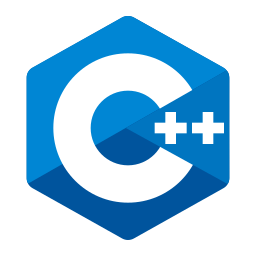
  
  
  

---

### 🎨 三维建模

  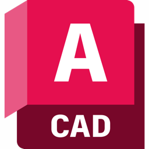
  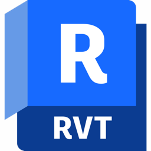
  
  

---

### 🧪 计算机仿真

  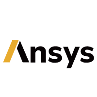
  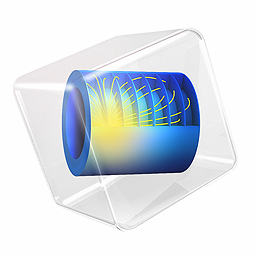

---

### ✍️ 编辑器 / IDE

  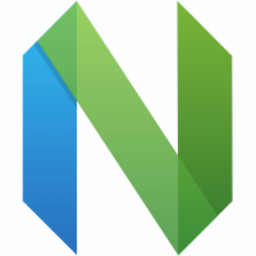
  
  
  
  
  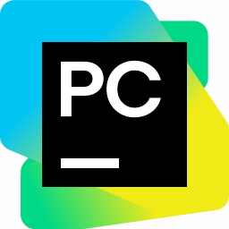

💡 我的neovim配置文件在这里，我将其称为 [Li2CO3VIM](https://github.com/Li2CO3ICU/Li2CO3VIM)

---

### 🖥️ 喜欢的操作系统

  
  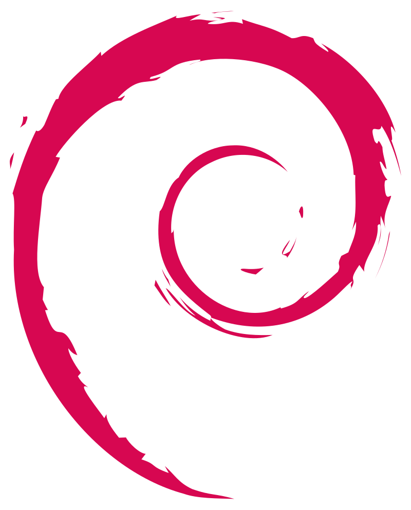
  
  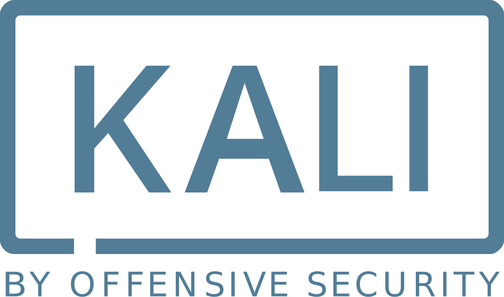
  

---

### 💻 终端环境

  
  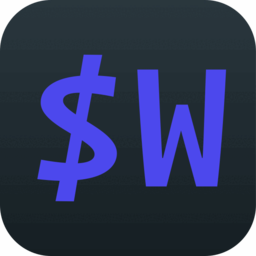

---

### 🍥 还有这些但是不知道该分什么类

  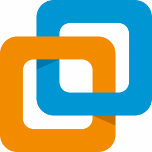
  

## 🌐 社交媒体

  
  
  
  

---

✨ 我们的存在，就是对恶意最大的反抗。

