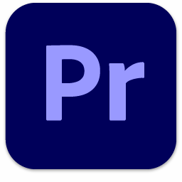
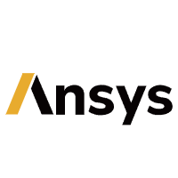

# 🏳️‍⚧️ 欢迎，这里是小锂
*(名字来源于一种药物——碳酸锂)*  

🌐 点击这里切换语言喔~ |Click here to change language | [简体中文](README.md) | [English](README_EN.md)  

---

## 💻 我的设备

因为我喜欢把每个小设备都打理得妥妥当当，它们都是我日常学习、创作、编程时的好伙伴～  
⌨️ **键盘**：RK R65  
🖱️ **鼠标**：MCHOSE A7 Pro  
🎧 **耳机**：ROG 降临 2  
💻 **笔记本**：ASUS 天选 3 Plus  

---
## 🧪 自我介绍

嘿呀，欢迎来到我的小世界！我是Li2CO3，虽然它是一种精神药物，但它代表的是我生活中的一份独特色彩。作为药娘[^药娘]，我总是试图在挑战中找到乐趣，在生活中的“bug”里也能看见一丝可爱的光亮。🌸

编程这条路上有时候挺孤单的，但正是每一次调试、解决问题的成就感，让我觉得所有的辛苦都是值得的！我喜欢在这条路上不断学习，虽然偶尔有点小迷茫，但每次跨过难关时的喜悦，简直像发现了一个彩蛋！💻💖

希望在这里和你们分享我的学习历程和点滴心情，既有计算机的技术分享，也有一点关于我作为药娘的感悟。一起快乐学习，遇到难题也能笑着走过！😊

[^药娘]:药娘是中国大陆网络用语，指通过激素疗法来维持女性特征的跨性别女性。
---

## 🛠️ 我的技能乱炖
~~学过的东西都好杂，各个领域都有涉及啦（~~  

### 🎬 影视后期  
我的影视后期技能主要来源于Adobe全家桶，基本上什么都能做一做～ 

  
  
  
  
  
  
  

---

### 💻 编程语言
学了好多语言，但每次碰到bug的时候，脑袋总是短路一下🤣  

  
  
  
  
  
  

---

### 🎨 三维建模
每次做建模的时候，感觉自己像在做小艺术品，虽然有时候挺复杂的，但还是很有成就感！ 

  
  
  
  

---

### 🧪 计算机仿真
计算机仿真就像是给模型加上魔法，可以让现实变得更有趣！

  
  

---

### ✍️ 编辑器 / IDE
这些工具我都很喜欢，每次在编辑器里工作，总觉得有点魔力～ 

  
  
  
  
  
  

💡 我的neovim配置文件在这里，我将其称为 [Li2CO3VIM](https://github.com/Li2CO3ICU/Li2CO3VIM)

---

### 🖥️ 喜欢的操作系统
我超级爱Arch Linux，每次启动它都觉得自己超强！

  
  
  
  
  

---

### 💻 终端环境
没有终端，我的生活好像少了点什么呢～  

  
  

---

### 🍥 还有这些但是不知道该分什么类
这些小工具也常常派上用场，虽然它们都不太属于某个大类，但它们是我学习和工作的小伙伴！  

  
  

## 🌐 社交媒体

        

---

✨ 我们的存在，就是对恶意最大的反抗。

