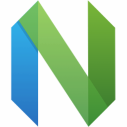
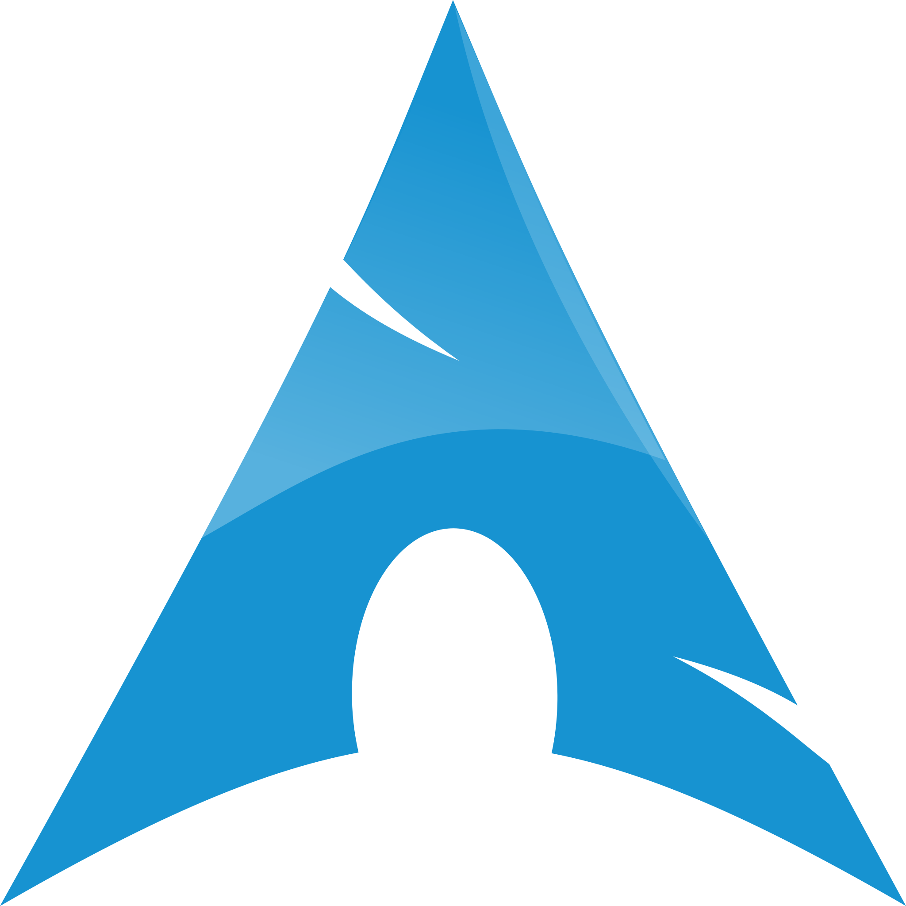
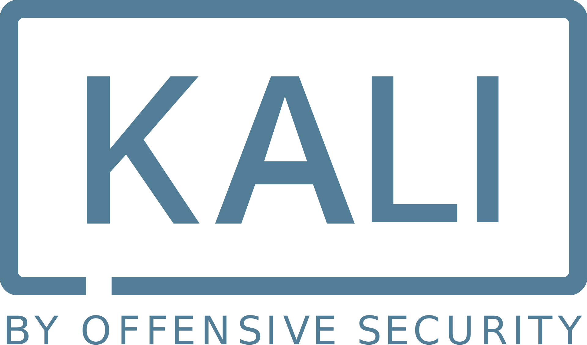

# 🏳️‍⚧️ Hello — I’m Li2CO3ICU
*(my name comes from a medicine — lithium carbonate)*

🌐 点击这里以切换语言~ | Click here to change language | [简体中文](README.md) | [English](README_EN.md)

---

## 💻 My Gear

I like to keep every little device tidy — they’re my daily companions for studying, creating, and coding~  
⌨️ **Keyboard**: RK R65  
🖱️ **Mouse**: MCHOSE A7 Pro  
🎧 **Headphones**: ROG Zephyrus 2  
💻 **Laptop**: ASUS TUF Gaming / ASUS Tianxuan 3 Plus

---

## 🧪 About Me

Hey — welcome to my little world! I go by **Li2CO3**. While that’s the name of a psychiatric medication, for me it’s just part of who I am — a little dash of uniqueness in life. As a *yao-niang*[^yao-niang], I try to find joy in challenges and spot something cute even inside life’s little “bugs.” 🌸

The programming path can feel lonely sometimes, but every successful debug and solved problem makes it totally worth it! I enjoy learning continuously — even when I get a bit lost, the moment I clear a hurdle feels like finding a hidden easter egg. 💻💖

Here I share my learning journey and bits of my heart: technical write-ups about computers, plus some reflections from my life as a mtf. Let’s learn happily and face tough problems with a smile! 😊

---

## 🛠️ Skills Mashup
(I’ve picked up a lot — a messy but fun mix across fields.)

### 🎬 Video & Post-production  
Most of my post-production skills come from the Adobe suite — I can handle a bit of everything.  

  
  
  
  
  
  
  

---

### 💻 Programming Languages
I’ve learned many languages — my brain sometimes short-circuits when bugs appear, though🤣  

  
  
  
  
  
  

---

### 🎨 3D Modeling
When I model, it feels like crafting little pieces of art — sometimes complex, but very rewarding!  

  
  
  
  

---

### 🧪 Computer Simulation
Simulations are like adding magic to models — they make reality more interesting!  

  
  

---

### ✍️ Editors / IDEs
These are my favorite tools — there’s always a bit of magic when I open an editor.  

  
  
  
  
  
  

💡 My Neovim config lives here — I call it [Li2CO3VIM](https://github.com/Li2CO3ICU/Li2CO3VIM)

---

### 🖥️ Favorite Operating Systems
I absolutely love Arch Linux — booting it up always gives me a little surge of confidence!  

  
  
  
  
  

---

### 💻 Terminal Environment
No terminal, no fun — it’s where I do most of my magic.  

  
  

---

### 🍥 Misc Tools (miscellaneous but handy)
These little helpers regularly come in handy even though they don’t fit a single category.  

  
  

---

## 🌐 Socials

  
  
  

---

✨ Our very existence is the greatest reply to malice.
# 🏳️‍⚧️ Hello — I’m Xiao Li  
*(my name comes from a medicine — lithium carbonate)*

🌐 Click here to switch language~ | Click here to change language | [简体中文](README.md) | [English](README_EN.md)

---

## 💻 My Gear

I like to keep every little device tidy — they’re my daily companions for studying, creating, and coding~  
⌨️ **Keyboard**: RK R65  
🖱️ **Mouse**: MCHOSE A7 Pro  
🎧 **Headphones**: ROG Zephyrus 2  
💻 **Laptop**: ASUS TUF Gaming / ASUS Tianxuan 3 Plus

---

## 🧪 About Me

Hey — welcome to my little world! I go by **Li2CO3**. While that’s the name of a psychiatric medication, for me it’s just part of who I am — a little dash of uniqueness in life. As a *yao-niang*[^yao-niang], I try to find joy in challenges and spot something cute even inside life’s little “bugs.” 🌸

The programming path can feel lonely sometimes, but every successful debug and solved problem makes it totally worth it! I enjoy learning continuously — even when I get a bit lost, the moment I clear a hurdle feels like finding a hidden easter egg. 💻💖

Here I share my learning journey and bits of my heart: technical write-ups about computers, plus some reflections from my life as a *yao-niang*. Let’s learn happily and face tough problems with a smile! 😊

[^yao-niang]: *Yao-niang* is a Chinese internet term referring to transgender women who use hormone therapy to maintain feminine characteristics.

---

## 🛠️ Skills Mashup
(I’ve picked up a lot — a messy but fun mix across fields.)

### 🎬 Video & Post-production  
Most of my post-production skills come from the Adobe suite — I can handle a bit of everything.  

  
  
  
  
  
  
  

---

### 💻 Programming Languages
I’ve learned many languages — my brain sometimes short-circuits when bugs appear, though🤣  

  
  
  
  
  
  

---

### 🎨 3D Modeling
When I model, it feels like crafting little pieces of art — sometimes complex, but very rewarding!  

  
  
  
  

---

### 🧪 Computer Simulation
Simulations are like adding magic to models — they make reality more interesting!  

  
  

---

### ✍️ Editors / IDEs
These are my favorite tools — there’s always a bit of magic when I open an editor.  

  
  
  
  
  
  

💡 My Neovim config lives here — I call it [Li2CO3VIM](https://github.com/Li2CO3ICU/Li2CO3VIM)

---

### 🖥️ Favorite Operating Systems
I absolutely love Arch Linux — booting it up always gives me a little surge of confidence!  

  
  
  
  
  

---

### 💻 Terminal Environment
No terminal, no fun — it’s where I do most of my magic.  

  
  

---

### 🍥 Misc Tools (miscellaneous but handy)
These little helpers regularly come in handy even though they don’t fit a single category.  

  
  

---

## 🌐 Socials

  
  
  

---

✨ Our existence is resistance. 
