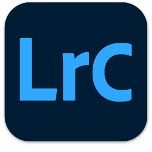
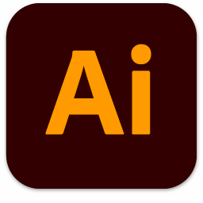
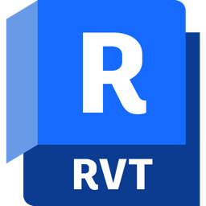

# 🏳️‍⚧️ Welcome, I'm Li2CO3ICU
*(The name comes from a medication called Lithium Carbonate)*  

🌏 Language Switch | [简体中文](README.md) | [English](README_EN.md)  

---

## 💻 My Devices

⌨️ **Keyboard**: RK R65  
🖱️ **Mouse**: MCHOSE A7 Pro  
🎧 **Headset**: ROG Cetra II Core  
💻 **Laptop**: ASUS TUF Dash 3 Puls  

---

## 🛠️ My Skills
~~I’ve dabbled in a wide range of fields, a bit messy but fun!~~  

### 🎬 Video Post-Production  
~~Basically Adobe Creative Suite~~  

  
  
  
  
  
  
  

---

### 💻 Programming Languages

  
  
  
  
  

---

### 🎨 3D Modeling

  
  
  
  

---

### 🧪 Computer Simulation

  
  

---

### ✍️ Editors / IDEs

  
  
  
  
  
  

---

### 🖥️ Favorite Operating Systems

  
  
  
  
  

---

### 💻 Terminal Environments

  
  

---

### 🍥 Misc Tools

  
  

---

## 🌐 Social Media

  
  
  
  

---

✨ Our existence is resistance. 
